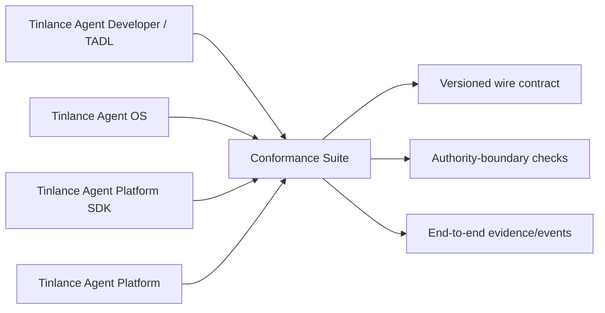

# Tinlance Agent Ecosystem Conformance v1

The conformance suite is the executable acceptance layer between the four independently
released repositories:



## Scope

The suite is intentionally stronger than a package smoke test. It verifies:

1. The ecosystem lock is structurally valid and pins full commit SHAs.
2. TADL can validate the canonical capability artifact.
3. The Platform API version and governed-execution contract match the lock.
4. Agent OS and the official SDK can consume the same Platform HTTP boundary.
5. Authenticated tenant/subject binding fails closed on mismatch.
6. Consequential operations are idempotent and conflicting reuse is rejected.
7. W3C trace context and idempotency metadata cross the client boundary.
8. HTTPS is required outside explicitly opted-in localhost test mode.
9. Repository dependency direction does not accidentally create a second authority kernel.

The suite deliberately does **not** claim hosted PostgreSQL, production secret management,
sandbox infrastructure, enterprise identity providers, or production telemetry. Those are
deployment/runtime acceptance concerns for M13.

## Run locally

From this repository:

```bash
npm ci
npm run build

# Install the exact locked consumers as the ecosystem workflow does.
python -m pip install /tmp/tinlance-platform /tmp/tinlance-platform_sdk /tmp/tinlance-os

python scripts/ecosystem_conformance.py
```

## CI rule

A shared contract change is not ecosystem-compatible until the conformance suite is green
against the reviewed revisions in `ecosystem.lock.json`.

The conformance suite is therefore a release gate, not an optional diagnostic.

## Security baseline

The workflow follows current OpenSSF guidance: least-privilege workflow permissions and
immutable action references. The suite complements repository-level Scorecard, CodeQL,
secret scanning, dependency review, and provenance controls; it does not replace them.

## Authority invariant

`effective authority = developer declaration ∩ Platform authorization`

Developer artifacts, OS state, model output, memory, retrieved content, tool results,
registry metadata, and peer-agent messages remain data. Only the Platform can authorize
consequential execution.
