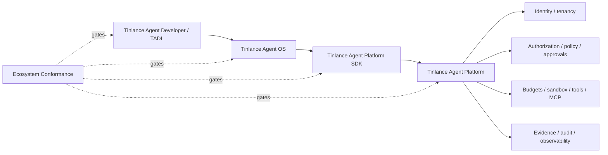

# Tinlance Agent Ecosystem Integration

The four repositories form one layered system while remaining independently owned and releasable.

## Authority model

- **Agent Developer (TADL):** packages, validates, evaluates, signs, and distributes developer artifacts. It declares capabilities but never grants them.
- **Agent OS:** owns workspaces, sessions, tasks, workflows, memory, applications, lifecycle, and presentation. It composes intent but never authorizes consequential actions.
- **Platform SDK:** provides the typed client contract, transport, idempotency, trace propagation, and response models. It contains no authority engine.
- **Agent Platform:** is the sole authority plane for identity, tenancy, authorization, policy, approvals, budgets, sandbox/tool authority, governed execution, evidence, and audit.
- **Conformance Suite:** proves the four layers still agree on the contract and dependency direction.

## Canonical consequential path

`developer artifact -> OS task/workflow -> SDK request -> Platform identity/authorization/policy/approval -> governed execution -> Platform evidence/events -> OS result`

Model output, retrieved content, memory, tool output, registry metadata, external responses, and peer-agent messages remain untrusted data unless independently validated by an authoritative boundary.

## Wire contract

- API version: **1.1**
- Endpoint: **POST /v1/agent-platform**
- Governed execution contract: **governed-execution.v1**
- Identity: tenant and subject are bound to the authenticated Platform principal.
- Consequential requests carry stable idempotency keys.
- Trace context uses W3C `traceparent` when supplied.
- Platform remains authoritative for approval and evidence validity.

## Conformance gate

`ecosystem.lock.json` pins the reviewed revisions. The ecosystem workflow materializes those
revisions and runs `scripts/ecosystem_conformance.py`.

A release is ecosystem-compatible only when the conformance suite is green. This is stronger
than a repository-local test and remains distinct from production infrastructure certification.

The conformance suite checks TADL artifact validity, API/contract compatibility, SDK and OS
round-trips, authenticated principal binding, idempotency conflict handling, trace/idempotency
metadata propagation, transport security, and authority dependency direction.

## Production boundary

The conformance suite proves the versioned contract and security invariants at the reference
HTTP boundary. It does not prove that production PostgreSQL, external secret management,
sandbox isolation, enterprise identity, hosted telemetry, backups, or incident response have
been deployed. Those are the post-M14 production-maturity acceptance gates defined by M15–M29. Supplemental M13.1–M13.3 hardening labels are retained only for implementation traceability and do not redefine the canonical M0–M14 roadmap.

## Domain integrations

FAS, FDSE, TADS, ReconOS, ThreatFade, Hezqara, FDSE Toolkit and FadeReach integrate above
these stable boundaries. They must consume the Platform authority plane rather than creating
parallel execution authority.

## Budget governance boundary

Consequential execution budget is Platform authority. Requests may carry declared execution limits, but only the Platform execution boundary can reserve, consume or release budget. Reservations are bound to tenant, agent, run, action and resource; quota exhaustion and scope/replay conflicts fail closed. SDK/OS/TADL layers must not implement local budget authority or treat client-side estimates as authorization.

## M13.5 tool authority reconciliation

TADL declares capabilities and tool metadata but does not grant execution authority. The Platform is the sole consequential tool authority; permits are Platform-issued and single-use, while sandbox workspace roots are deployment policy rather than developer-side authority.

## M13.6 — Secrets and credential governance

M13.6 secret governance: TADL secret references are metadata only. Platform-scoped handles are the only execution resolution authority; unscoped secret resolution is explicitly denied.

## M13.7 — Evidence, audit and non-repudiation

M13.7 evidence/audit boundary: TADL provenance declarations are metadata only. Platform owns evidence integrity, audit causality, execution/intent binding and external attestation; developer artifacts cannot mint authority.
